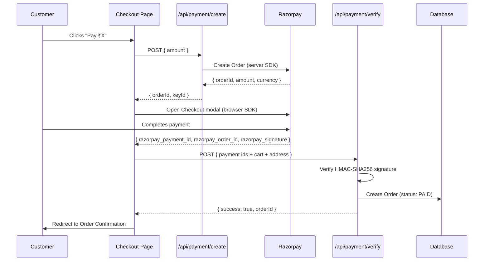
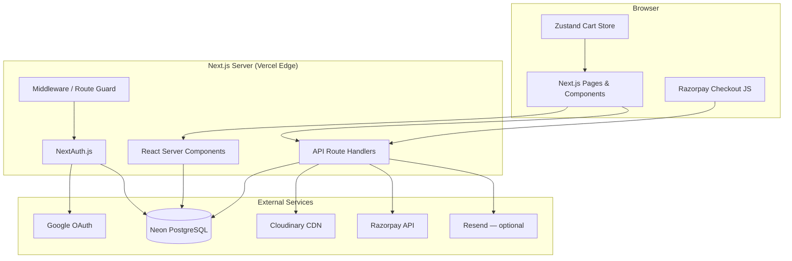

<h1 align="center">
  <br />
  🖨️ Printora
  <br />
</h1>

<h3 align="center">
  Full-stack custom merchandise printing platform with an interactive design studio, secure payments, and an admin dashboard — built with Next.js 16.
</h3>

<p align="center">
  <a href="https://nextjs.org"></a>
  <a href="https://www.typescriptlang.org"></a>
  <a href="https://www.prisma.io"></a>
  <a href="https://neon.tech"></a>
  <a href="https://razorpay.com"></a>
  <a href="https://vercel.com"></a>
  
</p>

<p align="center">
  <a href="#demo">Demo</a> •
  <a href="#features">Features</a> •
  <a href="#tech-stack">Tech Stack</a> •
  <a href="#installation">Installation</a> •
  <a href="#environment-variables">Environment Variables</a> •
  <a href="#deployment">Deployment</a>
</p>

---

## Demo

| Resource | Link |
|---|---|
| 🌐 Live Demo | [printora.vercel.app](https://printora-print-store.vercel.app/) |
| 💻 Repository | [github.com/chaitanyareddy4/printora](https://github.com/chaitanyaReddy4/printora.git) |

> **Note**
> Use the demo credentials to explore the platform:
> - **Customer:** `demo@printora.in` / `demo123456`
> - **Admin:** `admin@printora.in` / `admin@printora123`

---

## Screenshots

<details>
<summary>📸 View Screenshots</summary>

| Page | Preview |
|---|---|
| 🏠 Home | `screenshots/home.png` |
| 🛍️ Products | `screenshots/products.png` |
| 🎨 Design Studio | `screenshots/design-studio.png` |
| 🛒 Cart | `screenshots/cart.png` |
| 💳 Checkout | `screenshots/checkout.png` |
| ⚙️ Admin Dashboard | `Images/Admin Dashboard.png` |

</details>

---

## Features

### 🧑‍💻 Customer Features

- **Interactive Design Studio** — drag, drop, resize, and position custom graphics or text on products with a real-time canvas preview
- **Product Catalog** — browse products across multiple categories (apparel, accessories, stationery, and more)
- **Google Sign-In** — one-click authentication via Google OAuth
- **Email & Password Auth** — traditional sign-up / sign-in with bcrypt-hashed passwords
- **Shopping Cart** — persistent cart with quantity controls, promo code support, and live price calculation
- **Multi-step Checkout** — guided address → review → payment flow
- **Razorpay Payments** — UPI, cards, net banking, and wallets via Razorpay Checkout JS
- **Cash on Delivery** — COD option with ₹49 handling fee
- **Order History** — view all past orders with real-time status tracking
- **Order Tracking** — public tracking page by order number or guest email
- **Batch Orders** — organise group orders with a shareable submission link
- **Responsive UI** — pixel-perfect experience on mobile, tablet, and desktop

### 🔑 Admin Features

- **Admin Dashboard** — overview of orders, revenue, and product metrics
- **Order Management** — update order status, add tracking details, and trigger email updates
- **Product Management** — create and manage products with images, pricing, categories, and variants
- **Role-based Access Control** — `CUSTOMER` and `ADMIN` roles enforced at both the API and UI level

### 🔒 Security Features

- **Server-side session validation** on every protected API route
- **HMAC-SHA256 signature verification** for all Razorpay payment callbacks
- **`server-only`** guards on all modules containing secrets
- **Zod schema validation** on every API request body
- **No secrets exposed to the browser** — only `NEXT_PUBLIC_*` keys reach the client
- **Middleware-based route protection** — unauthenticated users are redirected before the page renders

### ⚙️ Technical Features

- Next.js 16 App Router with React Server Components
- Fully typed with TypeScript (strict mode)
- Prisma v7 ORM with connection pooling via Neon's serverless adapter
- Cloudinary for cloud image storage and transformation
- Optional Resend email integration — build succeeds without `RESEND_API_KEY`
- Optimistic UI updates and smooth animations via Framer Motion

---

## Tech Stack

| Layer | Technology | Purpose |
|---|---|---|
| **Framework** | [Next.js 16](https://nextjs.org) (App Router) | Full-stack React framework |
| **Language** | [TypeScript 5](https://www.typescriptlang.org) | Type safety |
| **Styling** | [Tailwind CSS](https://tailwindcss.com) | Utility-first CSS |
| **Animation** | [Framer Motion](https://www.framer.com/motion) | Page & component animations |
| **ORM** | [Prisma 7](https://www.prisma.io) | Type-safe database access |
| **Database** | [PostgreSQL](https://www.postgresql.org) via [Neon](https://neon.tech) | Serverless Postgres |
| **Auth** | [NextAuth.js](https://next-auth.js.org) | Sessions, Google OAuth, Credentials |
| **Payments** | [Razorpay](https://razorpay.com) | Indian payment gateway |
| **Storage** | [Cloudinary](https://cloudinary.com) | Image upload & CDN |
| **Validation** | [Zod](https://zod.dev) | Schema validation |
| **Forms** | [React Hook Form](https://react-hook-form.com) | Performant form handling |
| **Email** | [Resend](https://resend.com) *(optional)* | Transactional emails |
| **Deployment** | [Vercel](https://vercel.com) | Edge-optimised hosting |

---

## Project Structure

```
printora/
├── app/                          # Next.js App Router
│   ├── (auth)/                   # Auth pages (login, register)
│   ├── (public)/                 # Public pages (home, products, checkout)
│   │   ├── checkout/
│   │   ├── products/
│   │   │   └── [slug]/
│   │   │       └── design/       # Interactive design studio
│   │   └── track/
│   ├── admin/                    # Admin dashboard (role-gated)
│   │   ├── orders/
│   │   └── products/
│   ├── api/                      # API route handlers
│   │   ├── auth/
│   │   ├── batch/
│   │   ├── orders/
│   │   ├── payment/
│   │   │   ├── create/
│   │   │   └── verify/
│   │   ├── products/
│   │   └── upload/
│   ├── dashboard/                # Customer dashboard
│   └── globals.css
│
├── components/                   # Reusable UI components
│   ├── layout/                   # Navbar, Footer
│   └── ui/                       # Buttons, Cards, Modals
│
├── lib/                          # Shared server-side utilities
│   ├── auth.ts                   # NextAuth config
│   ├── email.ts                  # Optional Resend integration
│   ├── prisma.ts                 # Prisma client (singleton)
│   ├── razorpay.ts               # Server-only Razorpay SDK
│   └── utils.ts                  # Helpers
│
├── prisma/
│   ├── schema.prisma             # Database schema
│   └── seed.ts                   # Database seed script
│
├── stores/                       # Zustand client-side stores
│   └── cartStore.ts
│
├── types/                        # TypeScript declarations
│   └── razorpay.d.ts
│
├── prisma.config.ts              # Prisma v7 config (datasource URL)
├── proxy.ts                      # Next.js middleware (route protection)
└── .env.local                    # Environment variables (not committed)
```

---

## Installation

### Prerequisites

- Node.js 18+
- A [Neon](https://neon.tech) PostgreSQL database
- A [Razorpay](https://razorpay.com) account (test keys are free)
- A [Cloudinary](https://cloudinary.com) account (free tier available)
- A [Google OAuth](https://console.cloud.google.com) app

### Steps

**1. Clone the repository**

```bash
git clone https://github.com/yourusername/printora.git
cd printora
```

**2. Install dependencies**

```bash
npm install
```

**3. Configure environment variables**

```bash
cp .env.example .env.local
```

Edit `.env.local` with your credentials. See the [Environment Variables](#environment-variables) section below.

**4. Push the database schema**

```bash
npx prisma db push
```

**5. Seed the database**

```bash
npm run db:seed
```

**6. Start the development server**

```bash
npm run dev
```

Open [http://localhost:3000](http://localhost:3000) in your browser.

---

## Environment Variables

Create a `.env.local` file in the project root. A complete template is available in [`.env.example`](.env.example).

| Variable | Required | Description |
|---|---|---|
| `DATABASE_URL` | ✅ | PostgreSQL connection string (e.g. from Neon) |
| `NEXTAUTH_SECRET` | ✅ | Random secret for signing sessions (`openssl rand -base64 32`) |
| `NEXTAUTH_URL` | ✅ | Base URL of your app (`http://localhost:3000` in dev) |
| `GOOGLE_CLIENT_ID` | ✅ | Google OAuth 2.0 Client ID |
| `GOOGLE_CLIENT_SECRET` | ✅ | Google OAuth 2.0 Client Secret |
| `NEXT_PUBLIC_CLOUDINARY_CLOUD_NAME` | ✅ | Cloudinary cloud name |
| `CLOUDINARY_API_KEY` | ✅ | Cloudinary API key |
| `CLOUDINARY_API_SECRET` | ✅ | Cloudinary API secret |
| `RAZORPAY_KEY_ID` | ✅ | Razorpay Key ID (server-side) |
| `RAZORPAY_KEY_SECRET` | ✅ | Razorpay Key Secret (server-side, never exposed) |
| `NEXT_PUBLIC_RAZORPAY_KEY_ID` | ✅ | Same as `RAZORPAY_KEY_ID` — exposed to browser |
| `RESEND_API_KEY` | ⬜ Optional | Resend API key — emails are silently skipped if absent |
| `EMAIL_FROM` | ⬜ Optional | From address for emails (default: `noreply@printora.in`) |
| `NEXT_PUBLIC_APP_URL` | ⬜ Optional | Public URL for email links (default: `https://printora.in`) |

> **Tip**
> The application builds and runs fully without `RESEND_API_KEY`. When absent, all email functions log `"Email skipped: RESEND_API_KEY not configured."` and continue normally.

---

## Database

Printora uses **Prisma ORM v7** with a **PostgreSQL** database hosted on [Neon](https://neon.tech).

### Key Models

| Model | Description |
|---|---|
| `User` | Customer and admin accounts |
| `Product` | Printable products with variants |
| `Order` | Customer orders with line items |
| `OrderItem` | Individual products within an order |
| `OrderTimeline` | Status history for each order |
| `PromoCode` | Discount codes with usage limits |
| `BatchOrder` | Group ordering sessions |

### Setup Commands

```bash
# Generate the Prisma client
npx prisma generate

# Push the schema to your database (no migration files)
npx prisma db push

# Seed demo data (admin user, products, promo codes)
npm run db:seed

# Open Prisma Studio (visual DB browser)
npm run db:studio
```

---

## Authentication

Printora uses **[NextAuth.js](https://next-auth.js.org)** with two providers:

### Providers

| Provider | Description |
|---|---|
| **Google OAuth** | One-click sign-in via Google |
| **Credentials** | Email + bcrypt-hashed password |

### Roles

| Role | Access |
|---|---|
| `CUSTOMER` | Browse products, place orders, view own dashboard |
| `ADMIN` | All customer access + admin dashboard, order management, product management |

Role enforcement happens at two levels:
- **Middleware** (`proxy.ts`) — redirects unauthenticated requests before rendering
- **API routes** — every protected handler verifies the session and role server-side

---

## Payment Flow



> **Important**
> `RAZORPAY_KEY_SECRET` is **never** sent to the browser. Payment signature verification happens exclusively server-side using HMAC-SHA256. This prevents tampered or fake payment responses from being accepted.

---

## Architecture



---

## API Overview

| Method | Route | Auth | Description |
|---|---|---|---|
| `POST` | `/api/auth/register` | Public | Create a new account |
| `GET/POST` | `/api/auth/[...nextauth]` | Public | NextAuth handlers |
| `GET` | `/api/products` | Public | List all products |
| `GET` | `/api/products/[slug]` | Public | Get a single product |
| `POST` | `/api/orders` | Customer | Place a COD order |
| `GET` | `/api/orders/[id]` | Customer/Admin | Get order details |
| `PATCH` | `/api/orders/[id]` | Admin | Update order status |
| `POST` | `/api/payment/create` | Customer | Create a Razorpay order |
| `POST` | `/api/payment/verify` | Customer | Verify payment signature & save order |
| `POST` | `/api/upload` | Customer | Upload design image to Cloudinary |
| `GET` | `/api/track` | Public | Track order by number/email |
| `POST` | `/api/promo` | Customer | Validate a promo code |
| `POST` | `/api/batch` | Customer | Create a batch order session |
| `POST` | `/api/batch/[id]/submit` | Public | Submit a photo to a batch |
| `GET/PATCH` | `/api/user/profile` | Customer | Get or update profile |

---

## Deployment

Printora is optimised for zero-configuration deployment on **[Vercel](https://vercel.com)**.

### Steps

**1. Push your repository to GitHub**

**2. Import the project on Vercel**

Go to [vercel.com/new](https://vercel.com/new) and import your GitHub repository.

**3. Set environment variables**

In the Vercel dashboard → *Settings* → *Environment Variables*, add all variables from the [Environment Variables](#environment-variables) table.

**4. Deploy**

Vercel automatically runs `npm run build` and deploys. Subsequent pushes to `main` trigger automatic redeployments.

> **Tip**
> Set `NEXTAUTH_URL` to your Vercel production URL (e.g. `https://printora.vercel.app`).
> For the Neon database, use the **pooled connection string** for production to handle serverless cold starts efficiently.

### Available Scripts

```bash
npm run dev          # Start development server (Turbopack)
npm run build        # Production build
npm run start        # Start production server
npm run db:push      # Push Prisma schema to database
npm run db:seed      # Seed database with demo data
npm run db:studio    # Open Prisma Studio
```

---

## Future Improvements

| # | Feature | Description |
|---|---|---|
| 1 | 🎁 Wishlist | Save products for later |
| 2 | ⭐ Reviews & Ratings | Customer reviews with star ratings |
| 3 | 📦 Inventory Management | Track stock levels per variant |
| 4 | 🤖 AI Design Suggestions | Generate design ideas using generative AI |
| 5 | 📊 Analytics Dashboard | Revenue charts, best-selling products, user metrics |
| 6 | 🔔 Push Notifications | Browser push for order status updates |
| 7 | 📱 PWA Support | Installable progressive web app |
| 8 | 🏪 Multi-vendor | Support multiple print vendors |
| 9 | 🌍 Internationalisation | Multi-language and multi-currency support |
| 10 | 📧 Email Notifications | Automated transactional emails via Resend |

---

## Learning Outcomes

Building Printora covered the full spectrum of modern web development:

- **Full-stack architecture** with Next.js App Router and React Server Components
- **Authentication & authorisation** — OAuth, credentials, JWT sessions, and RBAC
- **Payment integration** — end-to-end Razorpay flow with server-side signature verification
- **Database design** — relational schema modelling with Prisma ORM
- **Cloud storage** — image upload pipelines with Cloudinary
- **API design** — RESTful routes with Zod validation and proper HTTP semantics
- **Security** — secret isolation, HMAC verification, middleware guards
- **TypeScript** — strict typing across the entire codebase including `window` extensions
- **Deployment** — CI/CD on Vercel with environment-aware configuration

---

## Author

**Chaitanya Reddy**

[
[
[

---

## License

This project is licensed under the **MIT License** — see the [LICENSE](LICENSE) file for details.

---

<p align="center">
  Made with ❤️ in India &nbsp;·&nbsp; <a href="https://printora-print-store.vercel.app/">printora.vercel.app</a>
</p>
